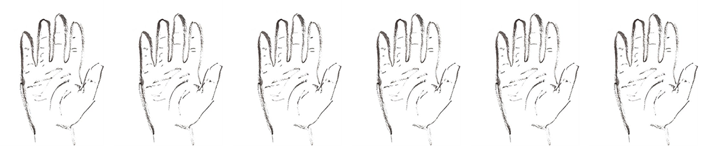

# Line Reader

Reads a line off of a text file. That's it.




## Example Usage
```
python line-reader__text.py \
  --text-file-input="source.txt" \
  --number-of-lines="(1,6)" \
  --output-dir="media/text" \
  --print-to-file
```
## Arguments

`--text-file-input=" "`

The source text file for the script.

`--number-of-lines=" "`

The number of lines that you want printed out. For a variable number, use `(x,y)`.

`--output-dir="  "`

Not specifying an output directory outputs a .txt in the directory that the script is in.

`--save-to-file`

Using this flag will output generated text as a .txt file.
